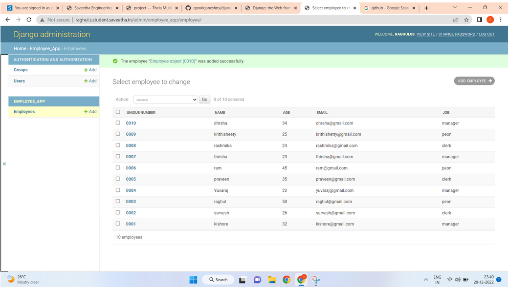
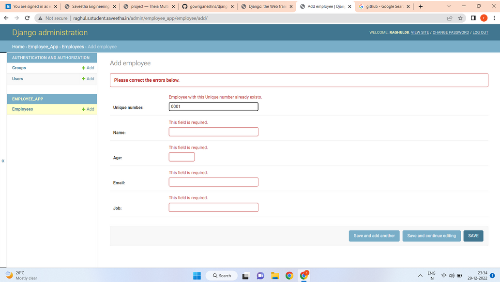

# Django ORM Web Application

## AIM
To develop a Django application to store and retrieve data from a database using Object Relational Mapping(ORM).

## Entity Relationship Diagram

Include your ER diagram here

## DESIGN STEPS

### STEP 1:
Create a Django app Go to the app directory In models.py create two classes And save the models.py

### STEP 2:
Go to admins.py And put the two class in admins.py from the models.py And save the file

### STEP 3:
Start the Django server Then move to admin page

## PROGRAM:
```
File: Models.py

from django.db import models
from django.contrib import admin

class Employee (models.Model):
    unique_number=models.CharField(max_length=20,primary_key=True)
    name=models.CharField(max_length=100)
    age=models.IntegerField()
    email=models.EmailField()
    job=models.CharField(max_length=100)

class EmployeeAdmin(admin.ModelAdmin):
    list_display=('unique_number','name','age','email','job')

File: Admin.py

from django.contrib import admin
from .models import Employee,EmployeeAdmin

admin.site.register(Employee,EmployeeAdmin)
```
## OUTPUT:



## RESULT
The output for Django ORM is successful.